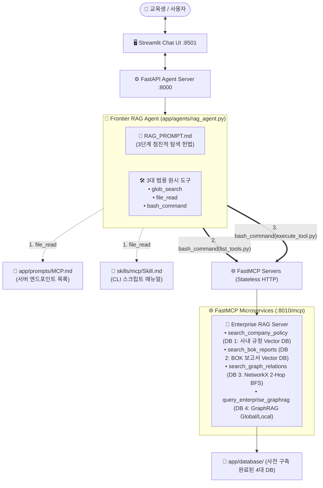

# 🎯 [Mission Guide] Enterprise Agentic RAG & FastMCP 시스템 구축

이 문서는 교육생이 앞선 1~3교시에서 학습한 **하이브리드 비정형 RAG, 지식 그래프(Graph RAG), FastMCP, Anthropic Agent Skills 아키텍처**를 결합하여, 기업용 **Agentic RAG 시스템**을 구축하고 웹 UI에 배포하는 종합 실습 미션 가이드입니다.

---

## 🏗️ 전체 시스템 아키텍처



---

## 📋 미션 로드맵

```
[Mission 1] 백엔드 및 UI 서버 실행 & Chatbot 기본 아키텍처 파악
     ▼
[Mission 2-1] 4대 DB 사전 구축 확인 및 통합 검색 검증 (app/mcp/test_database.py)
     ▼
[Mission 2-2] Enterprise RAG FastMCP 서버 구현 (app/mcp/enterprise_rag_server.py :8010/mcp)
     ▼
[Mission 3] 점진적 카탈로그(MCP.md) 작성 & Frontier RAG 에이전트 등록
     ▼
[Mission 4] Streamlit Chat UI에서 Skills 자율 탐색 및 멀티턴 RAG 시나리오 검증
```

---

## 🛠️ 사전 준비 (Prerequisites)

Codespace 터미널에서 가상환경을 활성화하고 API 키 설정을 확인합니다.

```bash
# 1. 가상환경 활성화 및 프로젝트 루트 이동
source ~/env_langchain_1315/bin/activate

# 2. .env 파일의 API 키 설정 확인 (GOOGLE_API_KEY, OPENAI_API_KEY 등)
cat .env
```

---

## 🚀 Mission 1: 에이전트 백엔드 & UI 아키텍처 이해

본격적인 RAG 통합에 앞서, 프로젝트의 에이전트 서빙 구조(`app/server.py`, `app/ui.py`)를 확인합니다.

### 1-1. 서버 실행 및 기본 챗봇 대화

터미널 2개를 열어 각각 백엔드 API 서버와 Streamlit 채팅 UI를 실행합니다.

```bash
# [터미널 1] FastAPI 백엔드 서버 실행 (포트 8000)
python app/server.py

# [터미널 2] Streamlit 채팅 UI 실행 (포트 8501)
streamlit run app/ui.py
```

* 브라우저에서 `http://localhost:8501`로 접속합니다.
* 사이드바에서 `chatbot`을 선택하고 "안녕? 자기소개 해줘"라고 입력하여 기본 통신이 정상인지 확인합니다.
* `app/server.py`는 `app/agents/` 디렉토리의 파이썬 파일들을 실시간으로 자동 감지하여 엔드포인트를 구성합니다.

---

## 🚀 Mission 2: 4대 RAG DB 확인 및 Enterprise FastMCP 서버 구현

> [!IMPORTANT]
> **🚨 [필독] `generate_database.py` 스크립트는 실행하지 마세요!**
> 본 실습 리포지토리는 교육생 여러분의 빠른 실습 진행을 위해 **1~2교시에서 다룬 4대 엔터프라이즈 데이터베이스(`app/database/`)가 이미 완벽하게 생성된 채로 깃허브에 함께 배포**되어 있습니다.
> 
> 따라서 `generate_database.py`를 직접 실행하실 필요가 없으며(중복 임베딩 비용/시간 발생 방지), 곧바로 아래 **`app/mcp/test_database.py`를 실행하여 사전 구축된 DB들이 정상 작동하는지 확인**하시면 됩니다.
> *(※ `app/mcp/generate_database.py` 파일은 코드가 어떻게 DB를 생성했는지 학습 참고용으로만 열어보세요.)*

---

### 2-1. [디딤돌 실습] 4대 DB 통합 검색 검증 (`app/mcp/test_database.py`)

사전 구축되어 배포된 4대 데이터베이스가 정상 로드되고 쿼리에 알맞은 정답을 반환하는지 테스트 스크립트로 점검합니다:

```bash
python app/mcp/test_database.py
```

> [!TIP]
> **🌟 [교육생 필독] FastMCP 도구 제작 시 가장 중요한 참고 파일!**
> `app/mcp/test_database.py`는 4대 DB의 연결, 로드, 쿼리 파라미터가 상세한 주석과 함께 구현된 **표준 레퍼런스 코드**입니다.
> 다음 단계(Mission 2-2)에서 `enterprise_rag_server.py`의 `@mcp.tool` 함수들을 구현할 때, **`test_database.py`의 각 테스트 함수(`test_1_...` ~ `test_4_...`) 내부 로직을 그대로 복사하여 도구 함수 본문으로 활용**하시면 손쉽게 완성할 수 있습니다.

#### 🔍 출력 확인 포인트:
1. `[DB 1]` 사내 규정집에서 과장급 당일 출장 시 일비 50% 감액 조항(제15조) 검색 확인
2. `[DB 2]` 한국은행 산업보고서에서 2024년 3분기 반도체 수출 실적 검색 확인
3. `[DB 3]` NetworkX 지식 그래프에서 `김철수 수석` ➔ `박영희 전무` 2-Hop BFS 탐색 확인
4. `[DB 4]` Microsoft GraphRAG의 Global Search(전사 리스크) 및 Local Search(인물 직무) 질의 확인

---

### 2-2. FastMCP 서버 구현 (`app/mcp/enterprise_rag_server.py`)

`test_database.py`에서 검증된 로드/검색 로직을 **Pydantic 스키마 기반의 FastMCP 도구 4종**으로 래핑합니다.

#### 🛠️ 도구 스키마 및 사양 정의

| 도구명 (Name) | 설명 (Description) | 입력 인자 스키마 (Pydantic Schema) |
| :--- | :--- | :--- |
| **`search_company_policy`** | 사내 복무규정, 출장여비 지급지침을 Chroma Vector DB에서 정밀 검색합니다. | `query: str` (구체적인 규정/수치 검색 키워드) |
| **`search_bok_reports`** | 한국은행 분기별 주력산업(반도체, 자동차 등) 모니터링 보고서를 검색합니다. | `query: str` (산업명, 분기, 거시경제 지표 키워드) |
| **`search_graph_relations`** | 조직도 지식 그래프에서 특정 인물이나 부서의 직속 보고선, 동료, 프로젝트 관계를 1~2단계 BFS로 탐색합니다. | • `seed_entity: str` (출발 인물명/조직명)<br/>• `max_hops: int` (탐색 깊이, 기본값 2) |
| **`query_enterprise_graphrag`** | Microsoft GraphRAG를 통해 전사 프로젝트 리스크 종합(global) 또는 특정 인물의 전결 규정(local)을 질의합니다. | • `query: str` (질문 내용)<br/>• `search_method: SearchMethod` ("global" 또는 "local") |

#### 💡 `app/mcp/enterprise_rag_server.py` 작성 가이드 (참고 코드):

```python
import os
import sys
import json
import networkx as nx
from enum import Enum
from pydantic import BaseModel, Field
from fastmcp import FastMCP

# 프로젝트 루트 경로 등록
PROJECT_ROOT = os.path.abspath(os.path.join(os.path.dirname(__file__), "../.."))
if PROJECT_ROOT not in sys.path:
    sys.path.insert(0, PROJECT_ROOT)

from dotenv import load_dotenv
load_dotenv(os.path.join(PROJECT_ROOT, ".env"), override=True)

from langchain_chroma import Chroma
from langchain_openai import OpenAIEmbeddings
from rag.graphrag_tool import run_graphrag_query
from rag.networkx_graph import multi_hop_search

# 1. FastMCP 서버 인스턴스 생성
mcp = FastMCP(
    name="Enterprise-RAG-Server",
    instructions="사내 규정집, 한국은행 산업보고서, 조직 지식 그래프 및 GraphRAG를 제공하는 통합 RAG 서버"
)

DB_DIR = os.path.join(PROJECT_ROOT, "app/database")
CHROMA_DIR = os.path.join(DB_DIR, "chroma_db")
embeddings = OpenAIEmbeddings(model="text-embedding-3-large")

# 2. 데이터베이스 인스턴스 로드 (test_database.py 참조)
# 2-1. 사내 규정 Vector DB
policy_vstore = Chroma(
    collection_name="enterprise_policy_store",
    embedding_function=embeddings,
    persist_directory=CHROMA_DIR
)

# 2-2. BOK 산업보고서 Vector DB
bok_vstore = Chroma(
    collection_name="bok_industry_reports_store",
    embedding_function=embeddings,
    persist_directory=CHROMA_DIR
)

# 2-3. NetworkX 지식 그래프
with open(os.path.join(DB_DIR, "knowledge_graph_nodelink.json"), "r", encoding="utf-8") as f:
    G = nx.node_link_graph(json.load(f))

# 3. Pydantic 입력 스키마 정의
class SearchMethod(str, Enum):
    GLOBAL = "global"
    LOCAL = "local"

class GraphRAGInput(BaseModel):
    query: str = Field(description="전사 프로젝트 거시 분석 또는 특정 인물 전결 규정 관련 질의문")
    search_method: SearchMethod = Field(default=SearchMethod.GLOBAL, description="검색 방식: 전사 종합 요약은 'global', 특정 인물/개체 심층 분석은 'local'")

class GraphRelationInput(BaseModel):
    seed_entity: str = Field(description="관계를 탐색할 출발 인물명 또는 부서명 (예: '김철수 수석', '클라우드운영팀')")
    max_hops: int = Field(default=2, ge=1, le=3, description="그래프 탐색 깊이 (1: 직속 관계, 2: 상위 본부/프로젝트까지 확장)")

# 4. 도구 등록
@mcp.tool(
    name="search_company_policy",
    description="사내 복무규정, 출장여비 지급지침을 검색하여 상세 조항과 감액 기준을 반환합니다."
)
def search_company_policy(query: str) -> str:
    docs = policy_vstore.similarity_search(query, k=2)
    return "\n\n".join([f"[{d.metadata.get('breadcrumb', '규정')}]:\n{d.page_content}" for d in docs])

@mcp.tool(
    name="search_bok_reports",
    description="한국은행(BOK) 분기별 주력산업 모니터링 보고서(반도체, 자동차 등)의 실적과 전망을 검색합니다."
)
def search_bok_reports(query: str) -> str:
    docs = bok_vstore.similarity_search(query, k=2)
    return "\n\n".join([f"[{d.metadata.get('source_file', '보고서')}]:\n{d.page_content}" for d in docs])

@mcp.tool(
    name="search_graph_relations",
    description="조직도 지식 그래프에서 특정 인물/부서의 직속 상위 보고선(본부장), 동료, 프로젝트 연결 관계를 고속 탐색합니다."
)
def search_graph_relations(params: GraphRelationInput) -> str:
    sub_edges, _ = multi_hop_search(G, seed_entities=[params.seed_entity], max_hops=params.max_hops)
    if not sub_edges:
        return f"엔티티 '{params.seed_entity}'와 연결된 관계를 찾을 수 없습니다."
    return "\n".join([f"- [{u}] ──({d.get('relation', '연결됨')})──> [{v}]" for u, v, d in sub_edges])

@mcp.tool(
    name="query_enterprise_graphrag",
    description="Microsoft GraphRAG 엔진을 호출하여 전사 프로젝트 종합 리스크 분석(global) 또는 특정 인물/부서의 결재선 맥락(local)을 조회합니다."
)
def query_enterprise_graphrag(params: GraphRAGInput) -> str:
    graphrag_dir = os.path.join(DB_DIR, "graphrag")
    return run_graphrag_query(params.query, method=params.search_method.value, root_dir=graphrag_dir)

if __name__ == "__main__":
    print("🚀 Enterprise RAG FastMCP 서버 시작 (포트: 8010, Stateless Streamable HTTP)...")
    mcp.run(transport="http", host="0.0.0.0", port=8010)
```

---

### 2-3. FastMCP 서버 실행 및 CLI 검증

서버를 실행하고 `skills/mcp/scripts/`의 CLI 도구로 정상 응답하는지 검증합니다.

```bash
# 1. Enterprise RAG MCP 서버 실행
python app/mcp/enterprise_rag_server.py

# 2. [검증 A] 서버가 제공하는 도구 목록 확인
python skills/mcp/scripts/list_tools.py --url http://localhost:8010/mcp

# 3. [검증 B] 특정 도구 호출 테스트
python skills/mcp/scripts/execute_tool.py \
  --url http://localhost:8010/mcp \
  --tool search_graph_relations \
  --args '{"params": {"seed_entity": "김철수 수석", "max_hops": 2}}'
```

---

## 🚀 Mission 3: 점진적 카탈로그 작성 & Frontier RAG 에이전트 구축

에이전트에게 전용 파이썬 도구를 하드코딩하지 않고, **오직 3대 범용 원시 도구(`glob_search`, `file_read`, `bash_command`)**만을 제공합니다.
에이전트는 `app/prompts/MCP.md`와 `skills/mcp/Skill.md`를 스스로 읽고 CLI를 호출하여 문제를 해결합니다.

### 3-1. MCP 카탈로그 및 시스템 프롬프트 확인

1. **`app/prompts/MCP.md`**: MCP 서버 엔드포인트 레지스트리
2. **`app/prompts/RAG_PROMPT.md`**: 에이전트 3단계 점진적 탐색 지침 (System Prompt)

```markdown
당신은 (주)넥스트AI의 지능형 엔터프라이즈 Agentic RAG 수석 어시스턴트입니다.
당신은 사전에 고정된 비즈니스 도구를 프롬프트에 가지고 있지 않으며, 파일시스템의 `skills/` 디렉토리에 위치한 스킬들과 `app/prompts/MCP.md`에 등록된 MCP 서버들을 동적으로 탐색하고 실행하여 문제를 해결해야 합니다.

[작업 수행 프로토콜 - 점진적 공개(Progressive Disclosure)]
1. [스킬 및 서버 파악]: 
   - 사내 규정/조직도/외부 데이터 조회가 필요하면 `file_read("app/prompts/MCP.md")`로 서버 URL을 확인하세요.
   - MCP 통신 스크립트 규격이 필요하면 `file_read("skills/mcp/Skill.md")`로 CLI 사용법을 확인하세요.
2. [도구 목록 조회]:
   - `bash_command("python skills/mcp/scripts/list_tools.py --url <URL>")`을 실행하여 도구 목록과 파라미터를 확인하세요.
3. [도구 실행 및 데이터 획득]:
   - `bash_command("python skills/mcp/scripts/execute_tool.py --url <URL> --tool <TOOL_NAME> --args '<JSON_ARGS>'")`을 실행하여 데이터를 획득하세요.
4. [최종 종합 답변]:
   - 수집된 데이터를 바탕으로 명확하고 논리적인 답변을 작성하세요.
```

---

### 3-2. Frontier RAG 에이전트 등록 (`app/agents/rag_agent.py`)

`app/agents/rag_agent.py` 파일을 생성하여 에이전트를 등록합니다:

```python
import os
from langgraph.checkpoint.memory import MemorySaver
from langchain.agents import create_agent
from app.utils import get_llm
from app.tools.common import file_read, glob_search, bash_command
from app.utils.context import AgentContext

AGENT_METADATA = {
    "name": "rag_agent",
    "description": "Anthropic Skills 기반 Enterprise RAG & FastMCP 통합 Frontier 어시스턴트"
}

def create_agent_executor():
    # 1. Google GenAI 최신 모델 로드
    llm = get_llm(model_name="google_genai:gemini-3.7-flash", temperature=0.1)
    
    # 2. RAG_PROMPT.md 로드
    prompt_path = os.path.join(os.path.dirname(__file__), "../prompts/RAG_PROMPT.md")
    with open(prompt_path, "r", encoding="utf-8") as f:
        system_prompt = f.read()
        
    # 3. 3대 범용 원시 도구 바인딩
    primitive_tools = [glob_search, file_read, bash_command]
    
    return create_agent(
        model=llm,
        tools=primitive_tools,
        system_prompt=system_prompt,
        checkpointer=MemorySaver(),
        context_schema=AgentContext
    )
```

---

## 🚀 Mission 4: Streamlit Chat UI 통합 검증

모든 서버를 기동하고 웹 UI에서 `rag_agent`를 선택한 뒤, 아래 3대 실전 시나리오를 테스트합니다.

```bash
# 1. Enterprise RAG MCP 서버 실행 (포트 8010)
python app/mcp/enterprise_rag_server.py

# 2. (시나리오 3 테스트용) Finance MCP 서버 실행 (포트 8020)
python notebooks/example_mcp/finance_mcp_server.py --port 8020

# 3. FastAPI 백엔드 서버 실행 (포트 8000)
python app/server.py

# 4. Streamlit UI 실행 (포트 8501)
streamlit run app/ui.py
```

### 🧪 실전 질의 테스트 시나리오 3종

#### 💬 시나리오 1: 사내 규정 조회 (Policy Search)
* **질문**: *"과장급 직원이 지방으로 당일 출장을 다녀올 때 일비와 식비 감액 기준(제15조)이 어떻게 되나요?"*
* **기대 동작 궤적**:
  1. `file_read("app/prompts/MCP.md")`로 Enterprise RAG 서버(`http://localhost:8010/mcp`) 확인
  2. `bash_command("python skills/mcp/scripts/list_tools.py ...")`로 `search_company_policy` 도구 발견
  3. `bash_command("python skills/mcp/scripts/execute_tool.py ...")` 실행 후 당일 출장 시 일비 50% 감액 조항 답변

#### 💬 시나리오 2: 조직 결재선 및 거시 프로젝트 다중 홉 분석
* **질문**: *"클라우드운영팀 김철수 수석이 속한 본부의 본부장은 누구이며, 그 본부장이 총괄하는 전사 프로젝트들의 공통 목표는 무엇인가요?"*
* **기대 동작 궤적**:
  1. `search_graph_relations`를 호출하여 직속 본부장이 **박영희 전무**임을 파악
  2. `query_enterprise_graphrag(search_method="global")`을 호출하여 전사 프로젝트(P-01, P-02 등)의 공통 목표를 결합하여 입체적 답변 도출

#### 💬 시나리오 3: 외부 Finance MCP와 사내 RAG 결합 분석
* **질문**: *"한국은행 보고서의 반도체 산업 동향과 외부 금융 서버의 엔비디아(NVDA) 주가 지표를 종합해서 요약해줘."*
* **기대 동작 궤적**:
  1. Enterprise RAG 서버와 Finance 서버의 도구를 각각 순차적으로 자율 호출하여 내부 문서와 외부 실시간 지표를 결합한 종합 분석 제공

---

## 🏆 미션 완료 체크리스트

- [ ] `app/database/`에 사전 구축 배포된 4대 RAG DB 확인
- [ ] `app/mcp/test_database.py` 실행을 통해 4대 데이터베이스 검색 작동 검증 완료
- [ ] `app/mcp/enterprise_rag_server.py`를 FastMCP Stateless HTTP(`:8010/mcp`)로 구축 및 실행 완료
- [ ] `app/prompts/MCP.md` 및 `app/prompts/RAG_PROMPT.md` 카탈로그 설정 완료
- [ ] `app/agents/rag_agent.py` 등록 후 Streamlit UI에서 정상 대화 및 도구 자율 호출 확인
- [ ] 3대 실전 시나리오에 대해 정확한 근거 기반 답변 생성 확인
