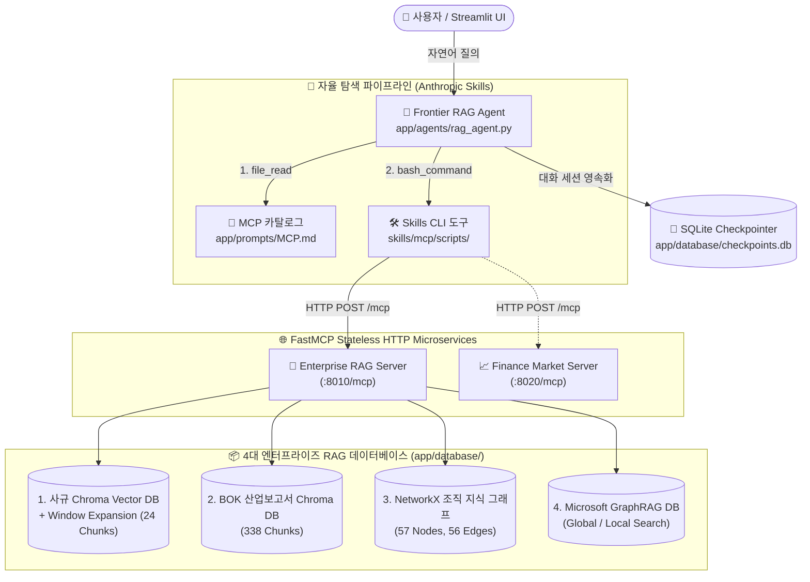

# 🏛️ Enterprise Agentic RAG 실무 마스터 과정

본 저장소는 **(주)넥스트AI**의 가상 엔터프라이즈 환경을 배경으로, **Chroma Vector DB, NetworkX 지식 그래프, Microsoft GraphRAG, FastMCP 마이크로서비스 및 Anthropic Agent Skills 표준**을 결합한 최첨단 **Frontier Agentic RAG 어시스턴트**를 단계별로 구축하고 실무에 배포하는 실습 교육 과정 코드베이스입니다.

---

## 🎯 핵심 학습 목표 및 아키텍처

기존의 단순 단일 벡터 검색(Naive RAG) 한계를 뛰어넘어, 질문의 복잡도와 데이터 특성에 따라 **사규(Window Expansion), BOK 산업보고서, 2-Hop 조직 지식 그래프, 전사 거시 프로젝트(GraphRAG)**를 스스로 자율 탐색 및 연계하는 프로덕션 레벨의 에이전틱 시스템을 완성합니다.



---

## 📚 4단계 실습 커리큘럼 (Jupyter Notebooks)

| 챕터 | 실습 노트북 | 핵심 학습 내용 |
| :--- | :--- | :--- |
| **Part 1** | [`notebooks/01_enterprise_rag_database.ipynb`](notebooks/01_enterprise_rag_database.ipynb) | • 사규 마크다운 계층 청킹 및 **Window Expansion(전문 복원)** 룩업 맵 구축<br/>• 한국은행(BOK) 4개 분기 주력산업 모니터링 보고서 PDF 벡터 인덱싱 |
| **Part 2** | [`notebooks/02_knowledge_graph_and_graphrag.ipynb`](notebooks/02_knowledge_graph_and_graphrag.ipynb) | • LLM 기반 엔티티-관계 트리플렛 추출 및 **NetworkX 2-Hop BFS** 탐색<br/>• **Microsoft GraphRAG** 커뮤니티 요약(Global) 및 엔티티 심층 질의(Local) |
| **Part 3** | [`notebooks/03_fastmcp_enterprise_rag_server.ipynb`](notebooks/03_fastmcp_enterprise_rag_server.ipynb) | • 최신 **FastMCP Stateless Streamable HTTP (`:8010/mcp`)** 마이크로서비스 개발<br/>• 4대 DB를 `@mcp.tool`로 노출하고 CLI를 통한 프로토콜 핸드셰이크 실습 |
| **Part 4** | [`notebooks/04_self_correction_and_evaluation.ipynb`](notebooks/04_self_correction_and_evaluation.ipynb) | • 문서 관련성 평가(Retrieval Grader) 기반 **Corrective RAG (CRAG)** 자가치유<br/>• **Ragas 프레임워크**를 활용한 충실도(Faithfulness), 답변 관련성 정량 평가 |

---

## 🚀 빠른 시작 (Quick Start)

### 1. 통합 환경 설정 및 의존성 설치 (`install_all.sh`)
로컬 WSL2(우분투) 환경에서 가상환경 활성화 후 통합 설치 스크립트를 실행합니다. (한글 나눔 폰트, 로케일, Python 패키지 설치 및 `.env` 파일 생성이 자동 수행됩니다.)

```bash
bash install/install_all.sh
```

### 2. 환경 변수 설정 (`.env`)
생성된 `.env` 파일에 Google Gemini API 키 및 필요 환경 변수를 입력합니다:

```env
GOOGLE_API_KEY="your-gemini-api-key"
OPENAI_API_KEY="your-openai-api-key" # 선택 (GraphRAG 또는 평가 시 활용)
LANGSMITH_TRACING="true"
LANGSMITH_PROJECT="enterprise-agentic-rag"
```

---

## 🖥️ 서버 및 웹 UI 가동 방법

본 프로젝트는 에이전트 마이크로서비스, 백엔드 API, 그리고 대화형 웹 인터페이스로 구성되어 있습니다.

```bash
# 1. Enterprise RAG FastMCP 서버 실행 (포트 8010)
python app/mcp/enterprise_rag_server.py

# 2. (선택/시나리오3) 외부 Finance FastMCP 서버 실행 (포트 8020)
python notebooks/example_mcp/finance_mcp_server.py --port 8020

# 3. FastAPI 에이전트 백엔드 서버 실행 (포트 8000)
python app/server.py --port 8000

# 4. Streamlit 웹 채팅 UI 실행 (포트 8501)
streamlit run app/ui.py
```

* 웹 브라우저에서 **`http://localhost:8501`** 에 접속하여 사이드바에서 `RAG_AGENT`를 선택하고 대화를 시작합니다.
* FastAPI 백엔드 API 명세서는 `http://localhost:8000/docs` 에서 확인 가능합니다.
* 상세 실전 시나리오 및 단계별 미션 가이드는 [`Mission.md`](Mission.md) 문서를 참고하세요.

---

## 📂 프로젝트 폴더 구조

```text
Agentic-RAG-course/
├── app/
│   ├── agents/
│   │   ├── chatbot.py                 # 기준 챗봇 (서버/UI 테스트용)
│   │   └── rag_agent.py               # 🌟 Frontier Agentic RAG 에이전트 (SQLite 영속화)
│   ├── database/                      # 📦 사전 구축 배포된 4대 엔터프라이즈 RAG DB
│   │   ├── chroma_db/                 #   ├── 통합 Chroma Vector DB (사규 & BOK 컬렉션)
│   │   ├── policy_chunks.pkl          #   ├── 사규 Window Expansion 룩업 딕셔너리
│   │   ├── knowledge_graph_nodelink.json #├── NetworkX NodeLink 지식 그래프
│   │   └── graphrag/                  #   └── Microsoft GraphRAG 인덱싱 아티팩트
│   ├── mcp/
│   │   ├── enterprise_rag_server.py   # 🌐 4대 DB FastMCP Stateless HTTP 마이크로서비스
│   │   ├── generate_database.py       # 🔨 4대 DB 원천 생성기 (In-place Overwrite 보장)
│   │   └── test_database.py           # 🔍 4대 DB 독립 검색 무결성 테스트 스크립트
│   ├── prompts/
│   │   ├── MCP.md                     # 📋 사내/사외 MCP 서버 엔드포인트 카탈로그
│   │   └── RAG_PROMPT.md              # 📜 (주)넥스트AI 3단계 점진적 탐색 시스템 프롬프트
│   ├── tools/
│   │   └── common.py                  # 🛠️ 3대 범용 원시 도구 (glob_search, file_read, bash_command)
│   ├── server.py                      # ⚙️ FastAPI 다중 에이전트 서빙 백엔드
│   └── ui.py                          # 🖥️ Streamlit RAG Agent Lab 웹 채팅 UI
│
├── data/                              # 📄 원천 데이터 (사규 MD, BOK PDF, 조직도 TXT)
├── notebooks/                         # 📓 4단계 실습 Jupyter Notebooks
├── skills/mcp/                        # 🧰 Anthropic Agent Skills CLI 스크립트 (list_tools, execute_tool)
├── Mission.md                         # 🏆 교육생용 4대 단계별 실습 가이드 문서
└── README.md                          # 📖 본 프로젝트 안내서
```

---

## 🌿 브랜치 전략

* **`main`**: 교육생 실습용 스타터 브랜치 (사전 구축 4대 DB, 프롬프트 템플릿, `Mission.md` 실습 가이드 포함)
* **`instructor`**: 강사용 모범 완성본 브랜치 (`enterprise_rag_server.py`, `rag_agent.py` 및 전체 E2E 테스트 검증 완료)
